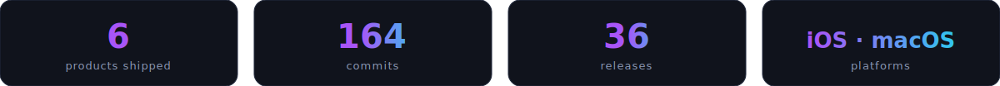
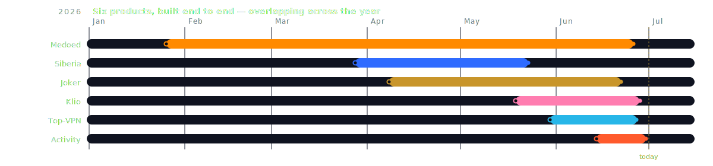
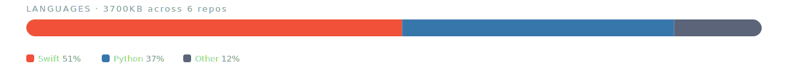

  

  <em>I design and build <b>complete mobile products</b> end to end — 
  native <b>Swift / SwiftUI</b> clients on async <b>Python / FastAPI</b> backends, from database to App Store.</em>

  
  
  

  

  

<h3 align="center">✦&nbsp;&nbsp;ABOUT&nbsp;&nbsp;✦</h3>

I'm a **solo full-stack mobile engineer** — I take a product from an empty repository to the App Store: the FastAPI backend, its database and realtime layer, the deployment, and a polished native SwiftUI client on top. I don't hand a spec to anyone; I design the data model, build the API, make WebSockets / packet tunnels / calls actually work on-device, and ship.

Across 2026 I shipped **six apps in very different domains** — real-time messaging with 1:1 WebRTC calls, a NetworkExtension VPN, a server-authoritative multiplayer game, and AI-assisted health and habit apps. Different problems, same discipline: own the whole stack, keep it fast, make it feel native.

Beyond mobile, I write **business-process automation** in Python — email/ticketing bots, ETL and data pipelines — and build **full-stack web apps** (Angular · Node/Express · .NET · PostgreSQL) for clients, from spec to a deployed server.

<h3 align="center">✦&nbsp;&nbsp;WHAT I BUILD&nbsp;&nbsp;✦</h3>

| Layer | What that means in my projects |
|-------|--------------------------------|
| **Native Apple** | SwiftUI for iOS & macOS · `NetworkExtension` packet tunnels · WebRTC + CallKit + PushKit calling · Keychain, offline caches, background tasks |
| **Async backends** | FastAPI · async SQLAlchemy 2.0 · WebSockets with Redis pub/sub fan-out · JWT + TOTP 2FA · Celery / ARQ / APScheduler workers |
| **Data & infra** | PostgreSQL + PostGIS · Redis · S3 / MinIO · Alembic migrations · Docker Compose · GitHub Actions CI |
| **AI** | Anthropic Claude — guided flows, multilingual generation (ru / en / es), correlation insights |

<h3 align="center">✦&nbsp;&nbsp;FEATURED WORK&nbsp;&nbsp;✦</h3>

Native app · API · realtime · infra — click any banner to open the repo.

<h3 align="center">✦&nbsp;&nbsp;SHIPPING TIMELINE&nbsp;&nbsp;✦</h3>

  

<h3 align="center">✦&nbsp;&nbsp;SELECTED ENGINEERING&nbsp;&nbsp;✦</h3>

**[Siberia](https://github.com/fire0clop/siberia) — a messenger, not a chat demo**
- 1:1 **WebRTC** voice/video with CallKit + PushKit VoIP and a coturn TURN template
- `/ws` channels with heartbeat and **Redis pub/sub fan-out** across instances; per-chat monotonic `sync_seq` catch-up so clients never miss a message
- Group chats, broadcast channels, S3 media with thumbnails and presigned URLs, PostgreSQL full-text search, **TOTP 2FA**, offline cache + reconnect gap recovery

**[Top-VPN](https://github.com/fire0clop/top-vpn) — a real packet tunnel**
- `NEPacketTunnelProvider` embedding **sing-box** via Libbox, memory capped at **45 MB** to survive iOS jetsam
- **VLESS + Reality** (uTLS Chrome fingerprint, vision flow) with client-side `urltest` auto-rotation across an endpoint pool
- Geo **split-tunneling** (RU-direct / foreign-proxy), split DNS, an antizapret domain pipeline compiled to on-device `.srs` rule-sets — shipped on **iOS *and* macOS**

**[Joker](https://github.com/fire0clop/joker) — server-authoritative game engine**
- Full "Козёл" rules engine — 38-card deck with dual jokers, bidding constraints, trick resolution, штанга penalties and per-pulka scoring — all resolved **on the server**
- Realtime table over WebSockets + Redis, private rooms with stake-tiered matchmaking and bot fills
- **ELO** ranking across six leagues, a zero-sum chip economy with a transaction ledger, Celery timers and anti-collusion logging

**[Klio](https://github.com/fire0clop/klio) · [Medoed](https://github.com/fire0clop/medoed) · [Activity](https://github.com/fire0clop/activity) — product surface**
- **Klio:** a goal taxonomy with streak scheduling and **Anthropic Claude** driving guided goal creation and multilingual (ru/en/es) daily insight cards
- **Medoed:** an insulin **bolus calculator** (ISF/IC ratios) over a carb-counting dish library and meal diary, with Sign in with Apple + Google
- **Activity:** a **PostGIS** proximity feed with cursor pagination, join/waitlist logic, WebSocket group chat and APNs + FCM push

<h3 align="center">✦&nbsp;&nbsp;AUTOMATION &amp; WEB&nbsp;&nbsp;✦</h3>

Beyond mobile — business automation and full-stack web, from spec to production.

Also full-stack web for clients — Angular · Node/Express · .NET · PostgreSQL — and Python data pipelines (kept in private repos; happy to walk through them).

<h3 align="center">✦&nbsp;&nbsp;TECH ARSENAL&nbsp;&nbsp;✦</h3>

  
  
  
  
  
  

  
  
  
  
  
  

  
  
  
  
  
  

  

<h3 align="center">✦&nbsp;&nbsp;LET'S TALK&nbsp;&nbsp;✦</h3>

  Open to <b>iOS / backend / full-stack</b> roles and freelance builds. 
  If you need a product taken from idea to the App Store by one person who owns the whole stack — let's talk.

  
  

  

◈ &nbsp; Built end to end — Swift on the surface, FastAPI underneath. &nbsp; ◈

